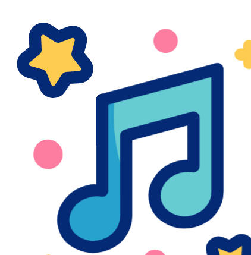

<h1 align="center"> Music Player Website </h1>

  

<!-- Badges Row -->

  
  
  
  

---

<h2>🚀 Live Demo</h2>
<ul>
  <li>🌐 <b>Website:</b> <a href="https://68c08ddf2443c7b025ba79b0--clever-brigadeiros-298ad5.netlify.app/">Music Player Website</a></li>
  <li>🎥 <b>Video Demo:</b> <a href="https://www.linkedin.com/posts/arnabjana369_learningprogress-codingchallenge-codingninjas-activity-7096893080938659840-M3dd">Watch on LinkedIn</a></li>
</ul>

---

<h2>✨ Features</h2>
<table>
  <tr><td>🎶 Music Control</td><td>Play / Pause / Skip</td></tr>
  <tr><td>📂 Playlist</td><td>Multiple track support</td></tr>
  <tr><td>📱 Responsive</td><td>Desktop + Mobile friendly</td></tr>
  <tr><td>🎨 UI Effects</td><td>Neon hover, smooth transitions</td></tr>
  <tr><td>🔊 Volume Control</td><td>Adjustable sound</td></tr>
  <tr><td>⏭️ Navigation</td><td>Next / Previous tracks</td></tr>
</table>

---

<h2>🛠️ Tech Stack</h2>

  
  

---

<h2>🖼️ Preview</h2>

  
  
  

---

<h2>📂 Project Structure</h2>
<pre>
📁 music-player-website
│── 📂 assets          # Music files & images
│── style.css          # Stylesheets
│── index.html         # Main player page
│── README.md          # Project documentation
</pre>

---

<h2>⚡ Getting Started</h2>
<pre>
# Clone this repository
git clone https://github.com/Arnab00369/MUSIC-PLAYER-WEBSITE-PROJECT.git  

# Go to project folder
cd music-player-website  

# Run the project
Open index.html in your browser
</pre>

---

<h2>🎨 Design Highlights</h2>
<ul>
  <li>🔘 Neon hover effects on buttons</li>
  <li>📊 Animated progress bar</li>
  <li>💡 Smooth transitions between songs</li>
  <li>🎧 Music-themed icons for better UX</li>
</ul>

---

<h2>🤝 Contribution Guidelines</h2>

<ol>
  <li>🍴 Fork the repository</li>
  <li>🌱 Create a new branch (<code>feature-branch</code>)</li>
  <li>💾 Commit your changes</li>
  <li>📤 Push to your branch</li>
  <li>🔁 Open a Pull Request</li>
</ol>

---

<h2>📜 License</h2>

This project is licensed under the <b>MIT License</b>.

  

---

  Made with ❤️ and 🎵 by <b>Arnab Jana</b>

